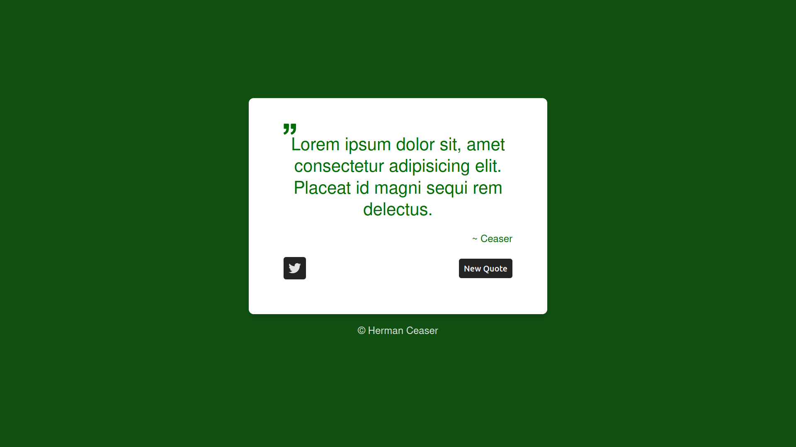
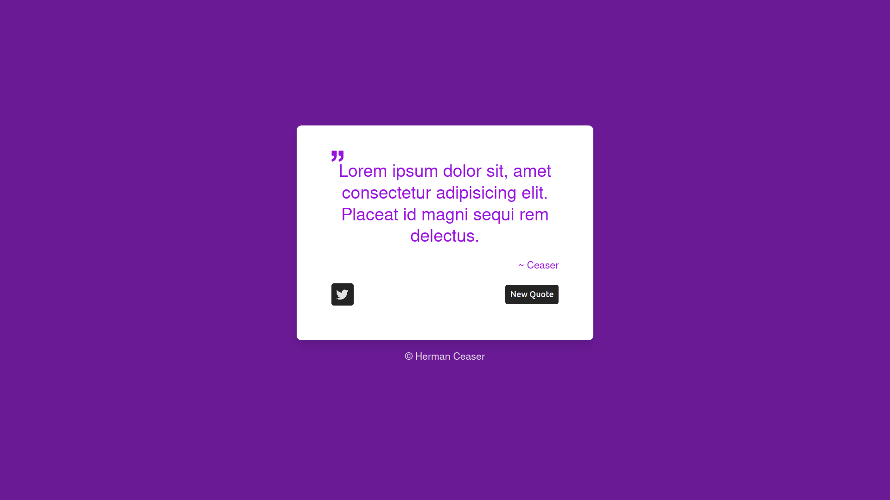
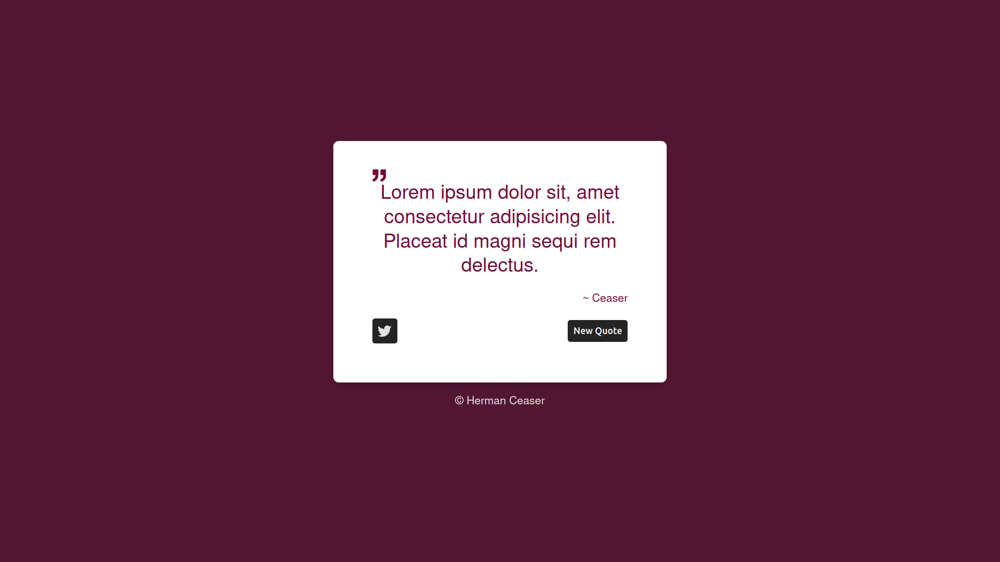

# Random Quote Generator
This app is a random Quote Generator built with Html5, SCSS and JavaScript.

## Features
- Generate a random quote on click of a button
- Tweet the generated quote
- Author of the quote is displayed
- Quote is displayed in a card
- Background Color changes on each click

## Installation
- clone the repo to your local machine
- navigate to the root of the project
- run `npm install` if you are using npm  or `yarn install` for yarn users
- run `npm run dev` if you are using npm  or `yarn dev` to run the app on your local server

## Usage
- Open the browser to http://localhost:3000
- Click on the button to generate a random quote
- Click on the tweet button to tweet the quote

## License
This project is licensed under the MIT License.

## Contributing
- Fork the repo on github and make a pull request
- If you have any questions or comments, please open an issue or contact me at:
  - [GitHub](github.com/HermanCeaser/random-quote-generator)
  - [Email](mailto:ceaserbanks09@gmail.com)

## Author
- Herman Ceaser

